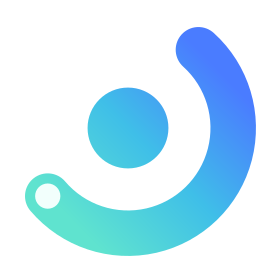

# AgentNotch

Mac のノッチとメニューバーから Claude Code のセッションを監視し、承認に応答するためのネイティブ macOS アプリ。

ターミナルで普段どおり `claude` を起動するだけで、実行中のセッション・トークン消費・レート制限の残量がノッチに表示され、ツールの承認要求をノッチから直接さばける。

名前に Claude を含めていないのは、他のコーディングエージェントにも広げられるようにしてあるため。現時点で読んでいるのは Claude Code のファイルだけ。

## 必要環境

- macOS 14 以降、Apple Silicon
- ソースからビルドする場合は Xcode 26 以降と [XcodeGen](https://github.com/yonaskolb/XcodeGen)（`brew install xcodegen`）

ノッチのある内蔵ディスプレイがなくても動作する。その場合はメニューバー中央に同等のピルを表示する。

複数のディスプレイをつないでいるときは、設定の「表示」で表示先を選べる。既定ではノッチのある画面を自動で選ぶ。選んだディスプレイを外している間は自動選択に戻り、つなぎ直すと元の画面に戻る。

## インストール

[リリース](https://github.com/piyoraik/AgentNotch/releases/latest)の `AgentNotch-<version>.zip` を展開し、`AgentNotch.app` を `/Applications` に置く。

**Apple の署名を受けていないため、そのままでは開けない。** 配布に必要な Developer ID を持っていないので、公証を通していない。ダウンロードした .app には macOS が quarantine 属性を付けるので、これを外す。

```bash
xattr -dr com.apple.quarantine /Applications/AgentNotch.app
```

外さずに開くと「開発元を検証できないため開けません」と言われる。macOS 15 以降は Control クリックの抜け道が塞がれているので、その場合は**システム設定 → プライバシーとセキュリティ**を開いていちばん下の「このまま開く」を押す。

AgentNotch は Dock アイコンを出さない（`LSUIElement`）。**起動したかどうかはメニューバーのアイコンとノッチで判断する。** 何も出てこない場合は quarantine が外れていない可能性が高い。

自分でビルドしたものにはこの制約はかからない。手順は「[ビルド](#ビルド)」を参照。

この手順が要るのは最初の 1 回だけ。0.11.0 以降はアプリから更新できる（「[ソフトウェア更新](#ソフトウェア更新)」）。

## 機能

### セッション監視

`~/.claude/sessions/*.json` を 1 秒ごと（設定で変更可）に読み、プロセスが生存しているセッションだけを一覧表示する。

一覧の各行に、クリックせずとも以下が並ぶ。

- プロジェクト名と実行状態（busy / idle）
- Claude が付けたセッションタイトル（無ければ直近のプロンプト）
- コンテキスト量・累計出力トークン・モデル名
- 最終アクティビティからの経過時間

行をクリックすると詳細に入り、トークン内訳（Context / Output / Cache read / Cache write）と直近 60 件のトランスクリプトを読める。

### 使用量メーター

`claude` CLI と同じ OAuth エンドポイントを 1 分ごと（設定で変更可・オフにもできる）に参照し、5 時間ウィンドウと週間ウィンドウの消費率とリセットまでの残り時間をノッチに常時表示する。

### 承認

`PermissionRequest` フックを登録しておくと、ツールの承認要求がノッチにポップアップし、**許可 / 拒否 / ターミナルで決める** を選べる。ターミナルを見ていなくても、承認待ちで止まっているセッションに気付ける。

何を承認するのかはツールに応じて出し分ける。Bash はコマンドと Claude 自身が付けた説明、Edit は変更前後の差分、Write は書き込む内容が並ぶので、パネルだけ見て判断できる。

フックの配置と登録は設定の「通知」から行える（「[承認機能のセットアップ](#承認機能のセットアップ)」）。

### 作業の完了

実行中だったセッションが待機に戻ったら、サウンドで知らせる。長い作業を投げてターミナルから目を離しているときに気付けるようにするためのもので、**フックの登録は要らない**（セッションファイルの状態を見ているだけ）。どのセッションが終わったのかは、パネルを開いたときにその行の「完了」で分かる。

すぐ返ってきた作業まで鳴らすとうるさいので、既定では 15 秒以上かかったものだけが対象。しきい値は設定の「通知」で変えられる（0 秒にすればすべて）。

折りたたんだピルの表示は変わらない。**ピルの右側を使うのは、まだ止まっているもの（承認・要応答）だけ**で、終わった知らせは使用量メーターを追い出さない。

### 応答待ち

プランの承認や `AskUserQuestion` の選択肢は**フックでは応答できない**。これらは `Notification` フックを登録しておくと、ノッチに「要応答」とだけ出る。答えるのはターミナルなので、ボタンは端末へのジャンプだけ。

同じ内容の承認ポップアップが出ているセッションでは表示しない。ターミナル側で答えて会話が進めば自動的に消える。

`Notification` は**答える必要のない場面でも飛ぶ**ので、受け取ってから 5 秒待ち、そのセッションが本当に止まったままのときだけ表示する。次のいずれかに当てはまるものは出ない。

- 承認パネルが出ている、または直前に承認を返した（常に許可のルールで黙って通した場合を含む）
- 2 分以上働いていない（開いたまま放置している端末）
- 完了として知らせたばかり（ターンが終わってプロンプトに戻った状態への催促）
- 通知が届いたあとにセッションが先へ進んだ

### 常に許可

同じ承認を繰り返さないよう、標準の承認を登録できる。

| 種別 | 範囲 |
| --- | --- |
| パターン | `xcodegen generate *` のような前方一致。Claude Code 自身が提案した範囲をそのまま使う |
| 完全一致 | 入力がまったく同じときだけ |
| ツール全体 | そのツールの呼び出しをすべて通す（強い。警告色で表示される） |

パターンで許可しても、`xcodegen generate && rm -rf /` のように**別のコマンドが連結されている場合は自動許可しない**。`&&` `;` `|` `` ` `` `$(` 改行 リダイレクトのいずれかを含むコマンドは、通常どおり承認を求める。

登録したルールはセッション一覧の盾バッジから一覧・削除できる。`~/.claude/settings.json` は書き換えないので、消せばアプリ側だけで元に戻る。

### ソフトウェア更新

1 日 1 回 GitHub のリリースを確認し、新しい版があればメニューバーのメニューと設定の「一般」に出る。**確認までが自動で、ダウンロードと入れ替えは押したときだけ行う。**

配布物には Ed25519 の署名が付いていて、アプリは自分に埋め込まれた公開鍵で検証してから展開する。秘密鍵はリリースを作るマシンにしかないので、GitHub 側が乗っ取られても署名のない配布物は実行されない。

非公開リポジトリのため取得には認証が要るが、アプリはトークンを持たない。ログイン済みの `gh` コマンドに任せる（`claude` CLI の資格情報を借りているのと同じ考え方）。`gh` が無い場合や未ログインの場合は、その旨を出して何もしない。

入れ替えは切り離したスクリプトが行う。動いているバンドルは自分自身を置き換えられないため。古いバンドルは削除せず退避してから差し替えるので、コピーに失敗しても元に戻る。フックが参照するブリッジのコピーも同時に更新する。

Xcode の DerivedData から起動しているビルドは更新の対象外。

### ターミナルへのジャンプ

一覧・詳細・承認画面のターミナルアイコンから、そのセッションを実行している端末を前面に出せる。iTerm2 と Terminal.app では tty を照合して**該当タブまで**選択する。それ以外の端末はアプリの前面化のみ。

### 設定

メニューバーアイコン →**設定…**（`⌘,`）で開く。変更は即時に反映され、`UserDefaults`（`com.piyoraik.AgentNotch`）に保存される。ペインは `⌘1`〜`⌘5` でも切り替えられ、`⌘W` / `Esc` で閉じる。前回開いていたペインを覚える。

| タブ | 変えられるもの |
| --- | --- |
| 一般 | ログイン時に起動、設定のリセット、終了 |
| 表示 | ノッチパネルの表示 / ホバーで展開するか / 折りたたみ時のメーター / 推定コスト / 表示先のディスプレイ / ウィングとパネルのサイズ |
| メニューバー | アイコンの表示 / セッション数のバッジ / メニュー内の使用量とタイトル |
| 通知 | フックの配置と登録 / 承認待ちで自動的に開くか / Dock で注意を促すか / サウンド / 完了を知らせるか（としきい値）/ 応答待ちを知らせるか |
| データ更新 | セッション・要約・トランスクリプトのポーリング間隔、使用量の取得可否と間隔 |

ホバー展開をオフにすると、ノッチはクリックしたときだけ開く。メニューバーアイコンとノッチパネルを両方隠した場合でも、`open -a AgentNotch`（または Finder から再度起動）で設定ウィンドウが開く。

## ビルド

```bash
xcodegen generate
xcodebuild -project AgentNotch.xcodeproj -scheme AgentNotch \
  -configuration Debug -destination 'platform=macOS' build
```

ビルド成果物は DerivedData に出る。パスは次のコマンドで得られる。

```bash
xcodebuild -project AgentNotch.xcodeproj -scheme AgentNotch \
  -showBuildSettings 2>/dev/null | awk '/ BUILT_PRODUCTS_DIR /{print $3}'
```

`open <上記パス>/AgentNotch.app` で起動する。Dock アイコンは出ない（`LSUIElement`）。**終了はメニューバーアイコン → 「AgentNotch を終了」**から行う。

ブリッジ（`agentnotch-bridge`）は `AgentNotch` の依存になっているので、このスキームをビルドすれば一緒に建ち、`AgentNotch.app/Contents/MacOS/` に入る。

### 配布用にまとめる / 自分のマシンに入れる

```bash
./Scripts/release.sh             # build/AgentNotch-<version>.zip を作る
./Scripts/release.sh --install   # さらに /Applications に入れ替えて起動し直す
```

Release でビルドし、Xcode の ad-hoc 署名が付ける `get-task-allow` を落としてから zip を作り、リリース鍵で署名する。**バージョンは `project.yml` の `MARKETING_VERSION` だけを直す。** `Info.plist` はそこを参照している。

リリース鍵は初回だけ作る。秘密鍵は `~/.config/agentnotch/release-key` に置かれ、**リポジトリには入れない。**

```bash
swift Scripts/signing.swift keygen   # 公開鍵を ReleaseSignature.swift に貼る
```

`release.sh` は署名したあと、`ReleaseSignature.swift` に埋まっている公開鍵で検証してから終わる。鍵が食い違ったまま配ると、受け取った側がアプリから更新できなくなるため。

リリースには zip と `.sig` の両方を載せる。署名が無いものはアプリが取りに行かない。

```bash
gh release create v<version> --notes-file <notes> \
  build/AgentNotch-<version>.zip build/AgentNotch-<version>.zip.sig
```

`--install` は動いている AgentNotch を終了してから `/Applications/AgentNotch.app` を置き換え、**フックが参照しているブリッジのコピーも更新してから**起動し直す。自分でビルドしたものに quarantine は付かないので `xattr` は要らない。

置き換え先に別のアプリがあった場合は `CFBundleIdentifier` が一致しないので中止する。

### アイコン

アイコンは自前のもので、`Design/generate-icon.py` が SVG とアプリアイコンの PNG を書き出す。形を変えるときはスクリプトの定数を直して回す（SVG は生成物なので手で直しても上書きされる）。

```bash
python3 Design/generate-icon.py
```

ラスタライズに Chrome のヘッドレスを使うので、`/Applications/Google Chrome.app` が要る。アイコンを作り直さないなら不要。

パネルの中で Claude Code を指しているマークだけは、Claude.app 同梱の公式トレイアイコンをそのまま使っている（`Resources/Assets.xcassets/ClaudeMark.imageset`）。アプリ自身のマーク（メニューバー・ノッチのピル・設定）とは別物。

## 承認機能のセットアップ

承認をノッチで受けるには、ブリッジの配置とフックの登録が要る。

### 設定から行う（推奨）

設定（`⌘,`）→ **通知** → フックの「セットアップ」。ブリッジのコピーと `~/.claude/settings.json` への登録（`PermissionRequest` と `Notification`）をまとめて行う。

- **書き換える前に `settings.json.agentnotch-<日時>.bak` を必ず作る。** 他のツールのフックや無関係な設定はそのまま残すが、整形（インデントやキーの順序）は失われる。
- 同じペインで現在の状態（ブリッジが最新か、フックが登録されているか）を確認できる。**アプリを更新すると起動時にブリッジのコピーも自動で追随する**ので、更新のたびに手で `cp` し直す必要はない。
- 解除も同じペインから。自分のエントリだけを消し、ブリッジのファイルは残す。

以下は手で行う場合の手順。

### 1. ブリッジを配置

ブリッジは `.app` に同梱されている。フックから参照するパスを固定するため、アプリの外に写しておく。

```bash
mkdir -p ~/Library/Application\ Support/AgentNotch/bin
cp /Applications/AgentNotch.app/Contents/MacOS/agentnotch-bridge \
  ~/Library/Application\ Support/AgentNotch/bin/
```

**フックから .app の中を直接指さない。** アプリを移動したり入れ替えたりするとパスが外れ、フックが実行できずに承認のたびにエラーが出る。

ソースからビルドしている場合は、コピー元を `$(xcodebuild -project AgentNotch.xcodeproj -scheme AgentNotch -showBuildSettings 2>/dev/null | awk '/ BUILT_PRODUCTS_DIR /{print $3}')/AgentNotch.app/Contents/MacOS/agentnotch-bridge` に読み替える。

アプリを更新したときは、このコピーもやり直す。

### 2. フックを登録

`~/.claude/settings.json` の `hooks` に追加する（**編集前にバックアップを取ること**）。

```json
{
  "hooks": {
    "PermissionRequest": [
      {
        "hooks": [
          {
            "type": "command",
            "command": "'/Users/<you>/Library/Application Support/AgentNotch/bin/agentnotch-bridge'",
            "timeout": 150
          }
        ]
      }
    ],
    "Notification": [
      {
        "hooks": [
          {
            "type": "command",
            "command": "'/Users/<you>/Library/Application Support/AgentNotch/bin/agentnotch-bridge'",
            "timeout": 10
          }
        ]
      }
    ]
  }
}
```

`Notification` は「応答待ち」の通知に使う。承認だけでよければ `PermissionRequest` の側だけで動く。同じブリッジがどちらのイベントも受け、`Notification` は**応答を待たずに即座に抜ける**。

登録後は、普段どおり `claude` を起動するだけでよい。特別なフラグは要らない。

### フェイルセーフ

AgentNotch が起動していない場合、ブリッジは **0.5 秒以内に終了コード 0・出力なし**で抜ける。これは「判断しない」と解釈され、通常どおりターミナルに承認プロンプトが出る。**アプリの不在や不具合でセッションがハングすることはない。**

ノッチ側で 120 秒応答がない場合も同様にターミナルへ委譲される。

## プライバシー

- セッション情報・トランスクリプトはすべてローカルのファイルから読む。外部に送信しない。
- ネットワーク通信は使用量エンドポイント（`api.anthropic.com/api/oauth/usage`）への参照のみ。認証には `claude` CLI が保存済みの OAuth トークンを使う。
- 承認のやり取りはローカルの Unix ドメインソケット内で完結する。

## 制限

- 承認できるのは**ツールの許可 / 拒否**まで。`AskUserQuestion` の選択肢やプラン承認はフックの対象外で、ターミナルで答える必要がある（止まっていることだけは「応答待ち」で分かる）。
- ノッチは MacBook 内蔵ディスプレイにしかない。外部ディスプレイで作業している場合、常用の入口はメニューバーアイコンになる。
- ターミナルのタブ特定に対応しているのは iTerm2 と Terminal.app のみ。初回はシステムの自動化許可ダイアログが出る。
- 配布している `.app` は未署名・未公証。初回に quarantine を外す手間がかかるほか、署名が更新ごとに変わるため、ターミナルの自動化許可を入れ直すよう求められることがある。
