# AgentNotch の使い方

インストールと仕様は [README](../README.md) にある。ここは**入れたあと何をどう見るか**だけを画面と一緒に並べたもの。画面は 0.15.1 のもの。

- [起動する](#起動する)
- [ノッチを読む](#ノッチを読む)
- [セッションを開く](#セッションを開く)
- [承認に答える](#承認に答える)
- [同じ承認を繰り返さない](#同じ承認を繰り返さない)
- [手が空いたことに気付く](#手が空いたことに気付く)
- [使った量を振り返る](#使った量を振り返る)
- [設定](#設定)
- [うまくいかないとき](#うまくいかないとき)

## 起動する

`/Applications/AgentNotch.app` を開く。**Dock にアイコンは出ない。**起動できたかどうかはメニューバーの輪のマークで判断する。

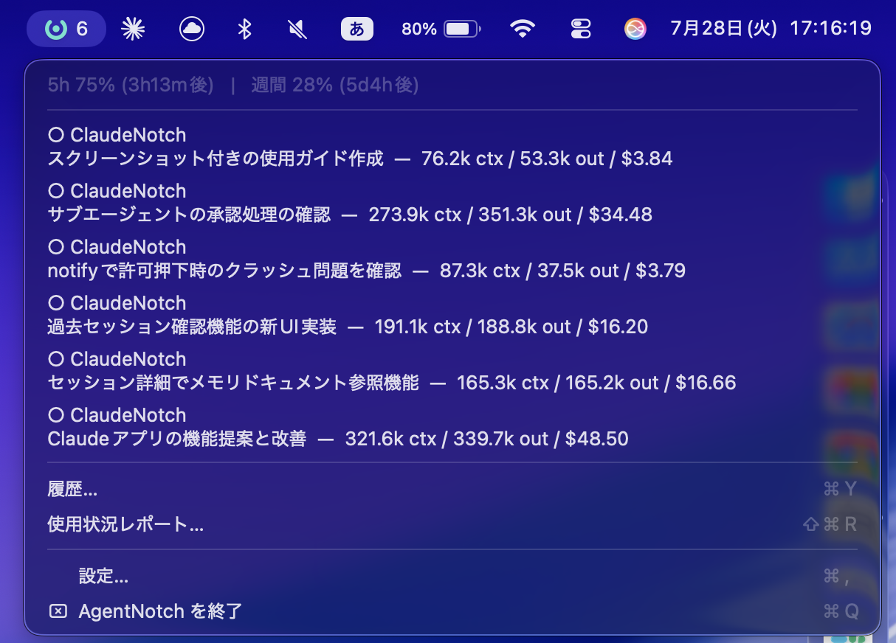

ここから設定（`⌘,`）・履歴（`⌘Y`）・使用状況レポートに入る。終了もここから。

ターミナルで `claude` を起動すると、そのセッションがノッチに現れる。**AgentNotch 側で何かを設定する必要はない**（承認をノッチで受けたい場合だけ、あとで一度セットアップが要る）。

## ノッチを読む

普段はノッチの左右に細く畳まれている。

| 位置 | 出るもの |
| --- | --- |
| 左 | 実行中セッションの数と、動いていることを示す点 |
| 右 | 5 時間ウィンドウと週間ウィンドウの使用量メーター |

**右側を奪うのは「まだ止まっているもの」だけ。**承認待ちと応答待ちのときだけメーターがバッジに変わる。作業が終わった知らせは音と一覧の側に出るので、ここは動かない。

ノッチのある内蔵ディスプレイを使っていない場合は、メニューバー中央に同じ形のピルが出る。

## セッションを開く

ノッチにカーソルを乗せるとパネルが開く（設定でクリック展開に変えられる）。

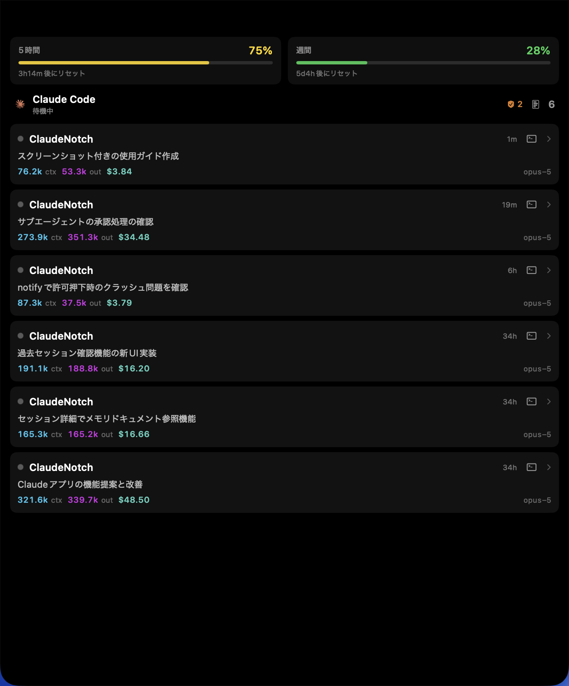

上端のメーターは 5 時間ウィンドウと週間ウィンドウの消費率とリセットまでの残り。各行にはプロジェクト名・状態・Claude が付けたタイトル・コンテキスト量・経過時間が並ぶ。

行をクリックすると詳細に入る。

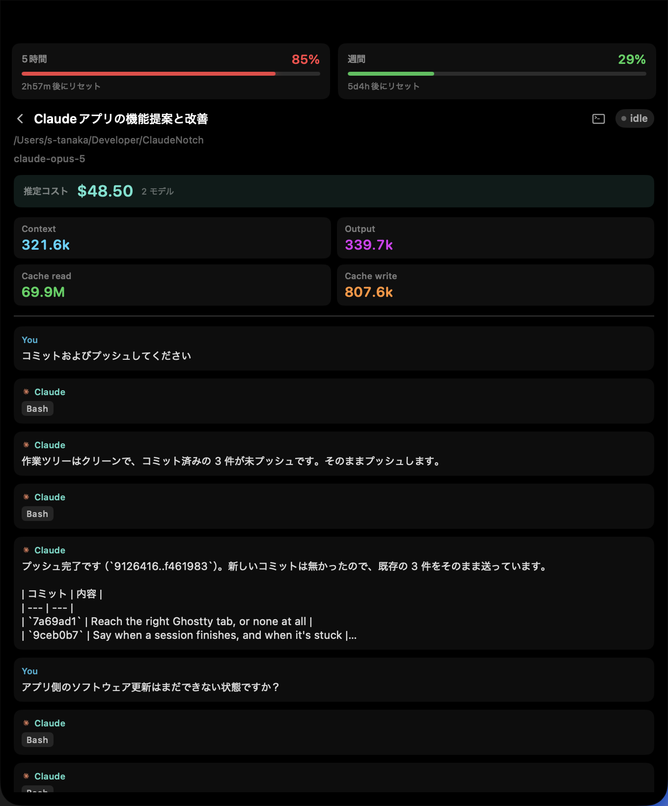

トークンの内訳（Context / Output / Cache read / Cache write）と直近 60 件のやり取りが読める。ターミナルのアイコンから、そのセッションが動いている端末を前面に出せる。iTerm2 と Terminal.app は**該当タブまで**選ぶ。

## 承認に答える

承認をノッチで受けるには一度だけセットアップが要る。設定（`⌘,`）→ **通知** → フックの「セットアップ」。

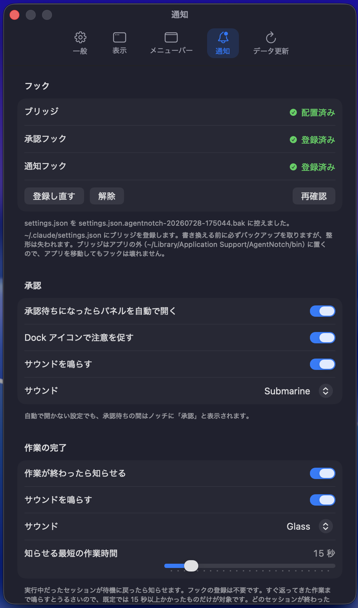

`~/.claude/settings.json` を書き換えるが、**書き換える前にバックアップを作る**（上の画面の `settings.json.agentnotch-<日時>.bak`）。他のツールのフックは残る。解除も同じ場所から。

以降、Claude Code がツールの許可を求めるとノッチが前に出る。

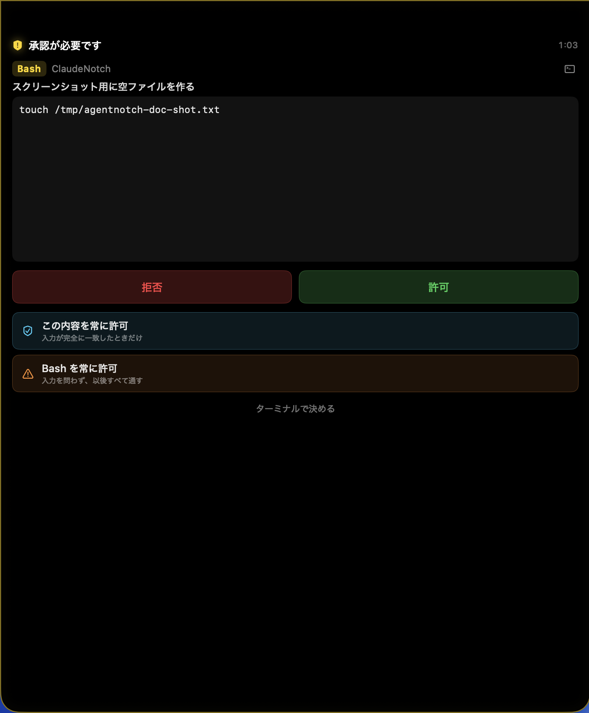

何を承認するのかはツールごとに出し分ける。Bash はコマンドと Claude 自身が付けた説明、Edit は変更前後の差分、Write は書き込む内容が並ぶ。

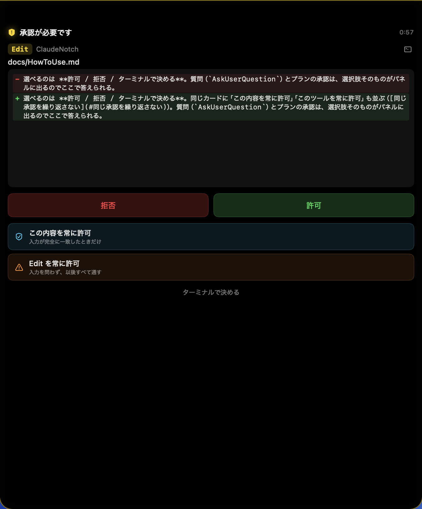

選べるのは **許可 / 拒否 / ターミナルで決める**。同じカードに「この内容を常に許可」「〈ツール名〉を常に許可」も並ぶ（[同じ承認を繰り返さない](#同じ承認を繰り返さない)）。質問（`AskUserQuestion`）とプランの承認は、選択肢そのものがパネルに出るのでここで答えられる。

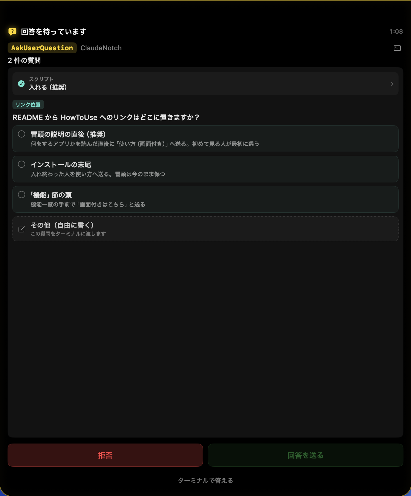

質問は 1 問ずつ開く。答え終わった質問は畳まれ、全問に選択が付くまで「回答を送る」は押せない。自由記述だけはパネルで受け取らないので、破線の「その他（自由に書く）」を選ぶとその質問はターミナルに渡る。

> **答えないまま放っておくと拒否になる。**フックを入れた時点で承認の窓口はノッチだけになり、放置してもターミナルにプロンプトは出ない。110 秒で自動的に拒否を返す（質問とプランだけはターミナルに送る）。

AgentNotch が起動していないときは、ブリッジが 0.5 秒以内に「判断しない」と返すので、**普段どおりターミナルで承認プロンプトが出る。**アプリの不在でセッションが止まることはない。

## 同じ承認を繰り返さない

承認カードの「常に許可」から、同じ要求を次から通せる。範囲は 3 段階。

| 種別 | 範囲 |
| --- | --- |
| パターン | `xcodegen generate *` のような前方一致 |
| 完全一致 | 入力がまったく同じときだけ |
| ツール全体 | そのツールの呼び出しをすべて通す（警告色で出る） |

パターンで許可しても、`xcodegen generate && rm -rf /` のように**別のコマンドが連結されていれば自動許可しない。**

登録したルールはセッション一覧の盾バッジから一覧・削除できる。

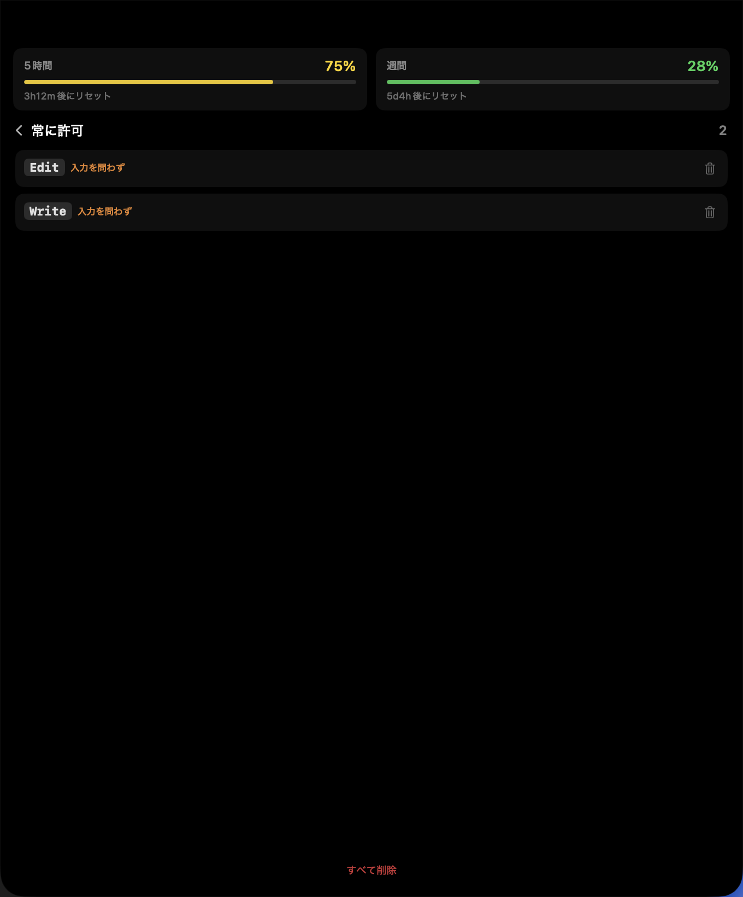

`~/.claude/settings.json` は書き換えないので、消せばアプリ側だけで元に戻る。

## 手が空いたことに気付く

- **作業の完了**：動いていたセッションが待機に戻ると音で知らせる。フックの登録は要らない。既定では 15 秒以上かかったものだけが対象（設定で変更可）。どのセッションが終わったのかは、パネルを開いたときの「完了」で分かる。
- **応答待ち**：ターミナル側で答える必要があるまま止まっているとき、ノッチに「要応答」と出る。ボタンは端末へのジャンプだけ。

前に出てくるのは**承認だけ**。完了と応答待ちは音とバッジまでで、作業中の画面を覆わない。

## 使った量を振り返る

メニューバーアイコン → **使用状況レポート…**。

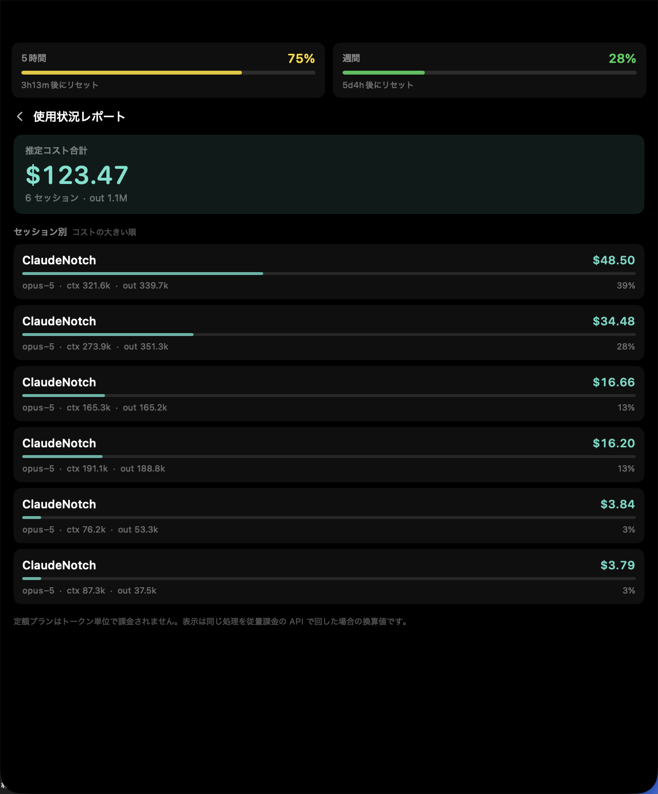

金額は**請求額ではない**。定額プランはトークン単位で課金されないので、ここに出るのは「同じ処理を従量課金の API で回した場合」の換算値。

終わったセッションを読み返すときは **履歴…**（`⌘Y`）。

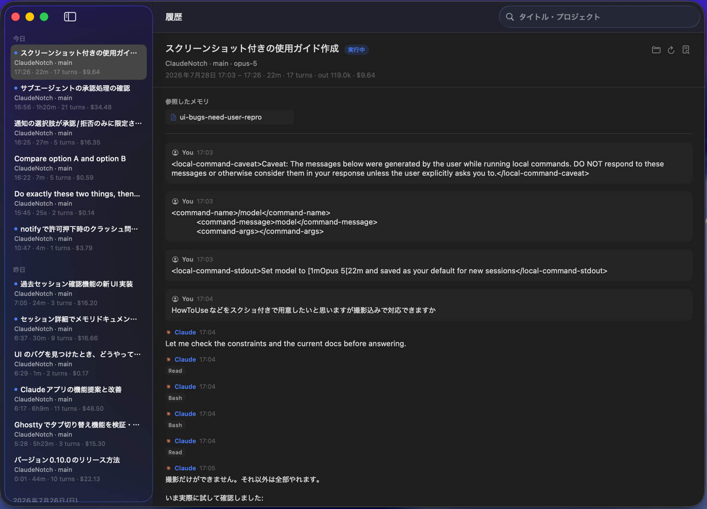

左に過去のセッション、右にその 1 本の全文。パネルと違って**途中を省略しない**。検索はツールバーの欄から。

## 設定

メニューバーアイコン → **設定…**（`⌘,`）。`⌘1`〜`⌘5` でペインを切り替えられる。

| タブ | 変えられるもの |
| --- | --- |
| 一般 | ログイン時に起動、設定のリセット、更新の確認 |
| 表示 | パネルの表示 / ホバー展開 / 折りたたみ時のメーター / 推定コスト / 表示先のディスプレイ / サイズ |
| メニューバー | アイコンの表示 / セッション数のバッジ / メニュー内の使用量 |
| 通知 | フックの配置と登録 / 自動で開くか / サウンド / 完了と応答待ちの知らせ |
| データ更新 | ポーリング間隔、使用量の取得可否と間隔 |

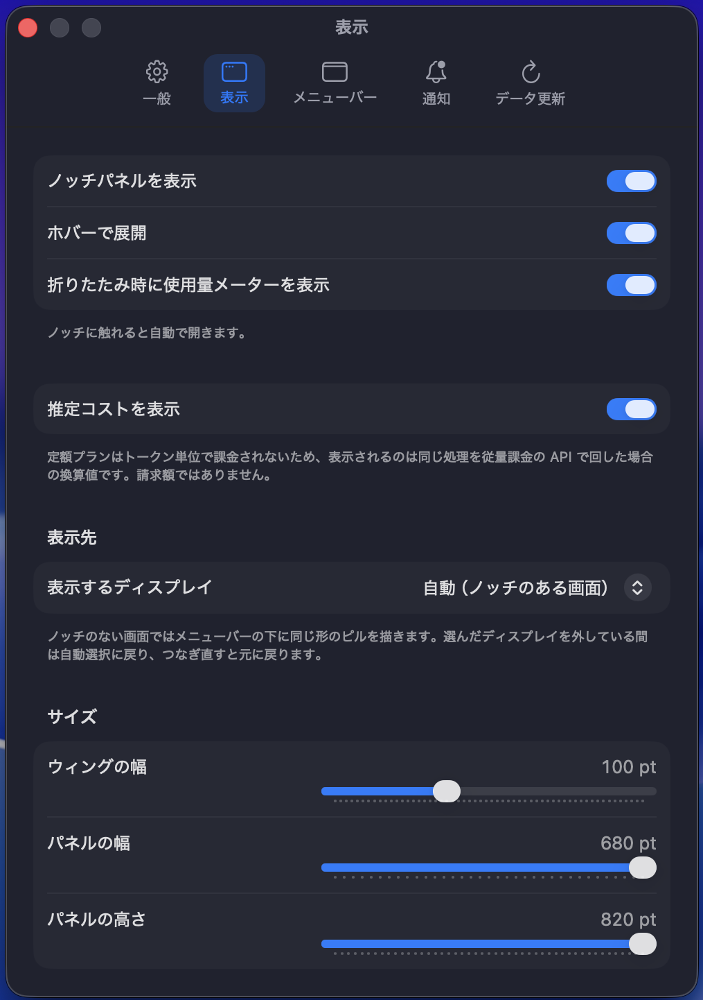

複数のディスプレイをつないでいるときは「表示」から表示先を選ぶ。既定はノッチのある画面の自動選択。**選んだディスプレイを外している間は自動選択に戻り、つなぎ直すと元の画面に戻る。**

## うまくいかないとき

| 症状 | 見るところ |
| --- | --- |
| 起動しても何も出ない | quarantine が外れていない可能性が高い（[README](../README.md#インストール)）。Dock にアイコンが出ないので、止められたことに気付きにくい |
| セッションが出てこない | `~/.claude/sessions/` に実行中のファイルがあるか。プロセスが生きているものだけを載せる |
| 承認がノッチに来ない | 設定 → 通知 でフックの登録状態を確認する。CLI 自身が安全と見なしたコマンドはそもそもフックまで来ない |
| ノッチもメニューバーも隠してしまった | `open -a AgentNotch` で設定ウィンドウに戻れる |
| ターミナルのタブに飛ばない | タブまで特定できるのは iTerm2 と Terminal.app のみ。初回はシステムの自動化許可ダイアログに答える必要がある |

---

この文書の画面は `Scripts/capture-docs.sh`（撮影）と `Scripts/crop-shot.swift`（切り出し）で作っている。差し替えるときは同じ台本を使うと大きさが揃う。
